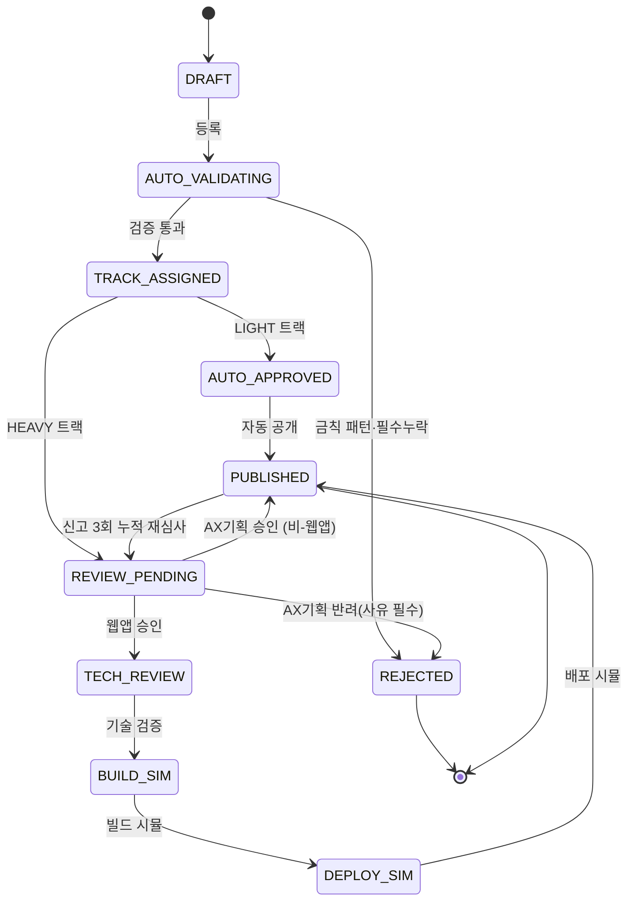

# DAOU AX 플레이그라운드 — PoC 백엔드

발표 시연에서 **"버튼 결과가 아니라 내부 구동 흐름"** 을 증명하기 위한 최소 백엔드입니다.
핵심은 하나 — **자산의 상태 전이가 실제 SQLite DB(`StatusHistory`)에 기록되는 상태 머신**.

> 인증 · 실제 Docker 빌드 · 실제 AI API 호출 · 배포 파이프라인 · 파일 업로드는 **만들지 않습니다.**
> 웹앱 빌드/배포는 `asyncio.sleep` 시뮬레이션으로 대체합니다. 외부 서비스 의존성 0 → 인터넷 없이 구동됩니다.

---

## 1. 설치 · 실행 (2줄)

```bash
pip install -r requirements.txt
uvicorn main:app --reload
```

- 기본 주소: `http://127.0.0.1:8000` / 자동 문서: `http://127.0.0.1:8000/docs`
- DB 파일 `ax_playground.db`가 자동 생성됩니다(첫 요청 시 테이블 생성).
- 웹앱 빌드 시뮬 속도 조절: `AX_SIM_DELAY`(초, 기본 `1.2`). PostgreSQL 전환: `AX_DATABASE_URL`.

> **이 PC 환경:** Python 3.12.10 설치 완료. `backend/.venv/` 가상환경이 이미 구성되어 있어
> 아래처럼 바로 실행할 수 있습니다(전역 설치 재실행 불필요):
> ```powershell
> cd C:\Users\intern02\Desktop\3주차\backend
> .\.venv\Scripts\python.exe -m uvicorn main:app --reload   # 서버
> .\.venv\Scripts\python.exe -m pytest -q                    # 테스트
> ```
> 검증 완료: `pytest 12 passed`, 시나리오 ①②·403·자동반려·seed 10건 모두 실서버에서 통과.

---

## 2. 상태 머신



**트랙 배정 룰**
- `PROMPT`·`AGENT` + (`L1`|`L2`) → **LIGHT** (룰 기반 자동 심사 → 즉시 공개)
- `AUTOMATION`·`WEBAPP` 이거나 `L3` → **HEAVY** (자동 검증 + AX기획팀 수동 심사, 웹앱은 AX개발팀 기술 검증 시뮬)

**자동 검증 룰(실제 구현)** — 위반 시 사유와 함께 `REJECTED`
- 필수 필드 존재 / `purpose` 최소 10자
- 금칙 패턴 정규식: 주민등록번호, 휴대전화, 이메일, `password`/`api_key`/`secret`

**점수 규칙(공급 측만)**
- 등록(검증 통과) **+3**
- 피가져가기 **+1** / 동일인 1회, 본인 제외, 자산당 보너스 상한 **+3**
- 소비 측 무점수(다독왕 랭킹은 별도 — 이 PoC 범위 밖)

---

## 3. API

| Method | Path | 설명 |
|---|---|---|
| `POST` | `/assets` | 등록 → 자동 검증 → 트랙 배정(LIGHT면 자동 공개) |
| `GET`  | `/assets?status=&type=&dept=` | 목록(필터) |
| `GET`  | `/assets/{id}` | 상세 + 전체 `status_history` |
| `POST` | `/assets/{id}/review` | HEAVY 심사. `actor_role != AX_PLAN` → 403 |
| `POST` | `/assets/{id}/take` | 가져가기 → `UsageLog` + 점수 |
| `POST` | `/assets/{id}/report` | 신고 → 3회 누적 시 `REVIEW_PENDING` 재진입 |
| `GET`  | `/audit` | 감사 로그 |
| `GET`  | `/scores` | 기여 점수판 |
| `GET`  | `/stats` | 등록·공개·가져가기 수, 트랙/유형별 건수 |
| `POST` | `/demo/seed` | 시연용 초기 데이터 10건 투입 |
| `POST` | `/demo/reset` | 전체 초기화 |

### 요청/응답 JSON 예시 (프론트 fetch 연동용)

**`POST /assets`**
```jsonc
// 요청
{
  "title": "주간 업무보고 초안 생성 프롬프트",
  "type": "PROMPT",            // PROMPT | AGENT | AUTOMATION | WEBAPP
  "platform": "GEMINI",        // GEMINI | CLAUDE | COPILOT | ETC
  "data_level": "L2",          // L1 | L2 | L3
  "author": "김민준",
  "dept": "경영지원본부",
  "purpose": "한 주간 업무를 항목별로 정리해 보고서 초안을 만드는 프롬프트입니다."
}
// 응답 201 (LIGHT는 즉시 PUBLISHED)
{
  "id": 1, "title": "주간 업무보고 초안 생성 프롬프트",
  "type": "PROMPT", "platform": "GEMINI", "data_level": "L2",
  "status": "PUBLISHED", "track": "LIGHT",
  "author": "김민준", "dept": "경영지원본부", "purpose": "...",
  "report_count": 0, "created_at": "2026-07-13T01:00:00", "updated_at": "...",
  "status_history": [
    {"from_status": null, "to_status": "DRAFT", "actor_role": "EMPLOYEE", "reason": "자산 등록", "timestamp": "..."},
    {"from_status": "DRAFT", "to_status": "AUTO_VALIDATING", "actor_role": "SYSTEM", "reason": "자동 검증 시작", "timestamp": "..."},
    {"from_status": "AUTO_VALIDATING", "to_status": "TRACK_ASSIGNED", "actor_role": "SYSTEM", "reason": "트랙 배정: LIGHT", "timestamp": "..."},
    {"from_status": "TRACK_ASSIGNED", "to_status": "AUTO_APPROVED", "actor_role": "SYSTEM", "reason": "룰 기반 자동 승인", "timestamp": "..."},
    {"from_status": "AUTO_APPROVED", "to_status": "PUBLISHED", "actor_role": "SYSTEM", "reason": "공개", "timestamp": "..."}
  ]
}
```

**`POST /assets/{id}/review`**
```jsonc
// 요청
{ "actor_role": "AX_PLAN", "decision": "APPROVE", "reason": "정책 부합 확인" }
// decision: "APPROVE" | "REJECT"  (REJECT는 reason 필수)
// 응답 200: 자산 객체(+status_history). 웹앱 승인 시 status는 REVIEW_PENDING로 반환되고
//           이후 TECH_REVIEW→BUILD_SIM→DEPLOY_SIM→PUBLISHED가 백그라운드로 점등 → 폴링으로 확인
// 권한 없음: 403 { "detail": "심사 권한은 AX기획팀(AX_PLAN)에만 있습니다" }
```

**`POST /assets/{id}/take`**
```jsonc
// 요청
{ "user": "이서연" }
// 응답 200
{ "asset_id": 1, "user": "이서연", "score_awarded_to_author": true }
```

**`POST /assets/{id}/report`**
```jsonc
// 요청 (모두 선택)
{ "reporter": "박도윤", "reason": "부정확한 결과" }
// 응답 200
{ "asset_id": 1, "report_count": 0, "status": "REVIEW_PENDING", "reentered_review": true }
```

**`GET /stats`**
```jsonc
{
  "total_registered": 10, "published": 6, "review_pending": 4, "rejected": 0,
  "in_progress": 4, "takes": 8,
  "by_track": { "LIGHT": 6, "HEAVY": 4, "UNASSIGNED": 0 },
  "by_type": { "PROMPT": 3, "AGENT": 4, "AUTOMATION": 2, "WEBAPP": 1 }
}
```

**`GET /scores`**
```jsonc
{ "leaderboard": [ { "user": "김민준", "points": 8 }, { "user": "최지우", "points": 4 } ] }
```

---

## 4. 시연 시나리오 (curl 2벌)

> 실행 스크립트도 포함되어 있습니다 — 리눅스/맥/Git Bash: `bash scenario1.sh`, Windows PowerShell: `./scenario1.ps1`.
> PowerShell의 `curl`은 `Invoke-WebRequest` 별칭이므로 스크립트는 `curl.exe`를 씁니다.

먼저 초기화:
```bash
curl -s -X POST http://127.0.0.1:8000/demo/reset
```

### 시나리오 ① — Gem 등록 → 자동승인 → PUBLISHED → 가져가기
```bash
BASE=http://127.0.0.1:8000

# 1) 설정형 AI 에이전트(Gem) 등록 → LIGHT → 즉시 PUBLISHED
ID=$(curl -s -X POST $BASE/assets -H "Content-Type: application/json" -d '{
  "title":"인사 규정 안내 Gem","type":"AGENT","platform":"GEMINI","data_level":"L2",
  "author":"박도윤","dept":"경영지원본부",
  "purpose":"사내 인사 규정 질문에 규정 문서 기반으로 답하는 설정형 에이전트입니다."
}' | python -c "import sys,json;print(json.load(sys.stdin)['id'])")

# 2) 상태 이력 확인 (DRAFT→...→PUBLISHED가 실제 DB에 기록됨)
curl -s $BASE/assets/$ID | python -m json.tool

# 3) 다른 직원이 가져가기 → 공급자 점수 +1
curl -s -X POST $BASE/assets/$ID/take -H "Content-Type: application/json" -d '{"user":"이서연"}'

# 4) 점수판 확인
curl -s $BASE/scores | python -m json.tool
```

### 시나리오 ② — 웹앱 등록 → HEAVY → 심사 승인 → 빌드 시뮬 → PUBLISHED
```bash
BASE=http://127.0.0.1:8000

# 1) 웹앱 등록 → HEAVY → REVIEW_PENDING
ID=$(curl -s -X POST $BASE/assets -H "Content-Type: application/json" -d '{
  "title":"사내 연차 계산 웹앱","type":"WEBAPP","platform":"ETC","data_level":"L2",
  "author":"정하준","dept":"개발본부",
  "purpose":"입사일과 사용 연차를 입력하면 잔여 연차를 계산해 보여주는 웹앱입니다."
}' | python -c "import sys,json;print(json.load(sys.stdin)['id'])")

# 2) AX기획팀 승인 → 웹앱 빌드/배포 시뮬 백그라운드 시작
curl -s -X POST $BASE/assets/$ID/review -H "Content-Type: application/json" \
  -d '{"actor_role":"AX_PLAN","decision":"APPROVE","reason":"기술 검증 진행"}'

# 3) 상태가 순서대로 점등되는 것을 폴링으로 관찰 (기본 각 1.2초)
for i in 1 2 3 4 5; do sleep 1.3; curl -s $BASE/assets/$ID | \
  python -c "import sys,json;a=json.load(sys.stdin);print(a['status'])"; done

# 4) 최종 상태 이력: TECH_REVIEW→BUILD_SIM→DEPLOY_SIM→PUBLISHED 확인
curl -s $BASE/assets/$ID | python -m json.tool

# (참고) 권한 없는 심사는 403
curl -s -o /dev/null -w "%{http_code}\n" -X POST $BASE/assets/$ID/review \
  -H "Content-Type: application/json" -d '{"actor_role":"EMPLOYEE","decision":"APPROVE"}'
```

---

## 5. 테스트

```bash
pytest -q
```
`tests/`는 `AX_SIM_DELAY=0`으로 웹앱 시뮬을 즉시 완료시켜, 4유형 등록→PUBLISHED +
반려 1케이스 + 신고 재심사 1케이스 + 점수/상한을 검증합니다.

---

## 6. 파일 구조

```
backend/
├─ main.py           # FastAPI 앱 + 라우트
├─ database.py       # 엔진/세션 (SQLite→PostgreSQL 교체 가능)
├─ models.py         # Asset / StatusHistory / AuditLog / UsageLog / Score
├─ schemas.py        # 요청 바디 스키마(Pydantic)
├─ constants.py      # 상태·트랙·액터·전이표·점수 규칙
├─ services.py       # 검증·상태머신·심사·가져가기·신고·점수·직렬화
├─ seed_data.py      # 시연용 초기 데이터 10건
├─ requirements.txt
├─ scenario1.sh / scenario1.ps1
├─ scenario2.sh / scenario2.ps1
└─ tests/            # conftest.py, test_flow.py
```

## 7. 아키텍처 (참고)

React 프론트 → **FastAPI 백엔드(이 PoC)** → 자산관리/심사/로그 서비스 →
SQLite(PoC) / PostgreSQL(운영) → AI API·컨테이너 런타임(운영 단계, 여기서는 시뮬).
PoC 범위는 링크·프롬프트·설정형 자산 중심, 웹앱 Docker 배포는 확장 단계입니다.

## 8. 인증·SSO 확장 설계 (프론트 로그인 연동 기준)

PoC 시연은 **오프라인 모의 SSO**(프론트 로그인 화면)로 접근을 통제합니다 — 실제 OAuth는
외부 호출·클라이언트 시크릿이 필요해 "외부 의존성 0" 원칙과 충돌하므로 시연에서 제외했습니다.
실제 배포 시 아래 구조로 교체합니다.

**IdP 결정 (전제 확인 결과 반영)**
- GWS 계정은 `daou.co.kr` 도메인 → **Google Workspace를 단일 IdP(OIDC)로** 채택.
- 다우오피스 SSO와 Google Workspace SSO는 **아이디만 공유, 인증 시스템은 별개** →
  둘을 합치지 않고 **하나(GWS)만** 진짜 IdP로 연결. (다우오피스 로그인은 건드리지 않음)
- 도메인 제한: OIDC 요청에 `hd=daou.co.kr` + 서버측 `email` 도메인 재검증(hosted-domain 위조 방지).

**실제 흐름 (확장 단계)**
```
브라우저 → "Google Workspace로 계속" → Google OIDC 동의
  → code → 백엔드 /auth/callback (code 교환, id_token 검증: iss/aud/exp/hd)
  → 세션 발급(HttpOnly 쿠키 또는 단기 JWT) → 프로필(email·name·dept) 확보
  → 역할 매핑(디렉터리/그룹 → 직원·AX기획팀·AX개발팀·보안법무)
```

**역할 매핑 → 기존 액터 모델**
- Google Directory의 조직단위/그룹을 4-액터(직원·AX기획팀·AX개발팀·보안·법무)로 매핑.
- 로그인 정체성이 자산의 `author`/`dept`, 심사의 `actor_role`(현재 body 전달 → 세션에서 주입),
  가져가기의 `user`로 흐름. **심사 API의 `AX_PLAN` 게이트(403)가 이때 실질적 권한 통제가 됨.**

**PoC와의 차이 (교체 지점만)**
| 항목 | PoC(현재) | 실제 |
|---|---|---|
| 로그인 | 프론트 모의 계정 선택 | Google OIDC 리다이렉트 |
| 세션 | localStorage | HttpOnly 쿠키/JWT |
| actor_role | 요청 body로 전달 | 세션에서 서버가 주입 |
| 사용자 정보 | 프론트 디렉터리(3계정) | Google Directory API |

> 코드 교체 범위는 로그인 화면 + 백엔드 `/auth/*` 한 곳에 격리됩니다. 상태머신·점수·감사 로그 등
> 핵심 도메인 로직은 그대로 재사용됩니다(현재 `actor_role`를 파라미터로 받는 구조라 세션 주입만 추가).
